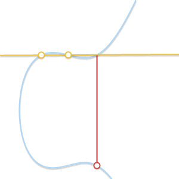

# schnorr-intro
A gentle introduction to Schnorr signature scheme using Eliptic Curve Cryptograph (ECC)

It was invented by german mathematician Claus-Peter Schnorr. Unfortunately he patented the scheme in 1988 (it expired in February 2008). So during the creation of Bitcoin it was "free", unfortunately the space lacked good libraries. Therefore ECDSA scheme was used.

## Eliptic Curve Cryptography 101

An elliptic curve is defined by formula:

a and b are parameters that define the curve and are carefully tuned.

Secp256k1 curve used by Bitcoin (and others) has the formula

 (a = 0, b = 7) and looks like this:

### Operations

We operate on points on the curve A, B, C, G, P (upper-case letters) all define points on the curve with an (x, y) coordinate.

#### Addition

We can define addition of two points A and B by drawing a line through those two points and where the line intersects the curve is the negative of the new point. After transposition over the x axis (y = 0) we get the actual result

The operation is commutative (A + B = B + A)

#### Multiplications with a scalar

We can also calculate an addition of point P with itself (P + P)
Since this is just one point we now draw a tangent to the curve

P + P is the same as 2*P
P + P + P is 3*P and so on.

So we can define multiplication in the form of k * P.

#### Discrete log problem

Multiplication is asociative but the neat part is that also by knowing P and the curve used we cannot easily "extract" k. 

From k -> kP is easy (we just do the adding or actually doubling) but kP -> k is very hard.

Usually we are given a standard curve (like Secp256k1) and generator point G.
Note: we cannot trust just any parameters because we might know something about G beforehand.

But basically random integer x can be a private key, while P = x*G is the public key.

## Schnorr signature scheme
