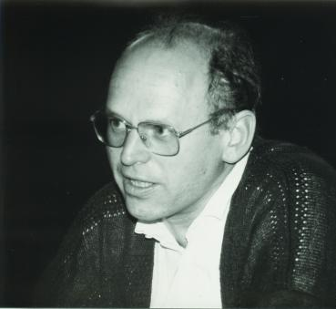

## Schnorr Signature Scheme

(Image: Claus-Peter Schnorr - from Wikipedia)

The scheme was invented by german mathematician Claus-Peter Schnorr.

Unfortunately he patented the scheme in 1988 (patent expired in February 2008). So during the creation of Bitcoin it was "free", however the space lacked good libraries. Therefore ECDSA scheme was used (which is more complicated on purpose to not violate the patent).

### Signature

Signature is the pair (R, s) that must be in a certain relation (that depends on private key and the thing that you want to sign).

We choose a random integer k and calculate

R = k*G

(ECC magic to hide it into R)

and s is defined as

**s = k - h*d**

(sometimes - is also + doesn't really matter)

k is that random number, d is your private key, public key is P=d*G.

h is hash(message || R || P)

### Verification

if we multiply s by publicly known G

we get the

s * G = k * G  - (h * d)*G

s * G = k * G - d*G * h

s * G = R - P * h

h = hash(message || R || P)

which we can verify since we have all that public data:
- public key P
- value R
- the actual message

### Forging an invalid signature

We could choose random R and calculate

R - hash(R)

however we cannot divide by G to get proper s

We can start with random k and calculate real R

but we don't know d so there is no way to forge signature.

### Randomness of k

k is called nonce since it must be used exactly once

If it isn't you can factor out d - which is your private key!

### Difference to ECDSA

In ECDSA calculation of s involves a division by k (which is not publicly known).

### Mu-Sig (n-of-n)

Traditionally with Bitcoin if you wanted that funds (UTXO) could be spent only when multiple people cooperate you could use multisig. This however means that for everyone involved another signature is added to the transaction.
With Schnorr signatures you can combine multiple signatures into one (and thus instead of n signatures just broadcast that 1, saving block space).

If you have private keys a and b, you could calculate public key X = (ai+bi) * G which could be spend by private key x = ai + bi (no matter what signature scheme is used). So in essence you can already "compress" keys.
Problem is just how will those two persons cooperate, because to spend each person will learn about the other one's private key (or else x cannot be calculated). You can imagine that despite "compressing keys" you can't "compress" signatures with ECDSA.

With Schnorr you can do the combination on the actual signatures, first persons sings and gives (Ra, sa) to second one. He can now calculate (Rx, sx) which will spend the funds. Usually Rx = Ra and sx = linear combination of sa and sb (which
is possible only with Schnorr signature scheme).

Mu-Sig is a method to actually implement this. Biggest complication comes from the fact that among the groups of signers if done in naive way last one to sign can always cheat in a way that the resulting signature can be produced ONLY by him (without
cooperation from others). You can imagine that he chooses his part in such a way that sum of all other signatures is 0. Note that Mu-Sig is always about n out of n signatures (you can't do threshold signatures, like 2-of-3). For that you still need to rely on traditional multisig method.

### Ring signatures

[Abe, Okhubo, Suzuki](https://cryptoservices.github.io/cryptography/2017/07/21/Sigs.html) usage of Schnorr signatures.

Idea is that you have participants with public keys P1, P2 ... Pn.

Anyone can sign but you can't know which of them did it. Something similar is used in Monero.

### Zero-knowledge proofs

Basically the signature scheme derives from an interactive zero-knowledge proof that you know a discrete logarithm **d** for a certain public value **P** (P = d*G).

You create a random R (R = k*G), give it to the peer and get some random value h from them.

Now only you can calculate s = k - h*d to convince the other side about your knowledge of d.

Using something called [Fiat-Shamir heuristic](https://en.wikipedia.org/wiki/Fiat%E2%80%93Shamir_heuristic) we can transform this interactive protocol to a non-interactive one. To do that we replace the other side who provides random h with a hash of all involved values H(G || P || R). And since G is a well-known constant anyway it is not necessary to include it in the hash and H(P || R) suffices.

[Previous - ECC](./ecc101.md) 

[Next - DLC](./dlc.md)
